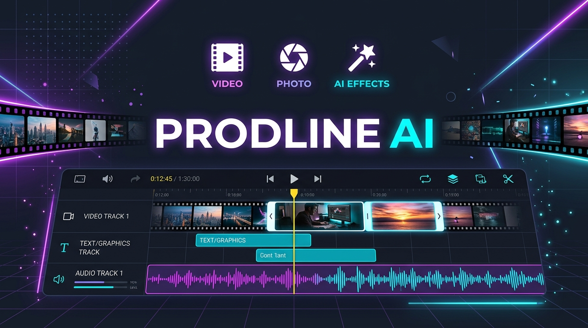
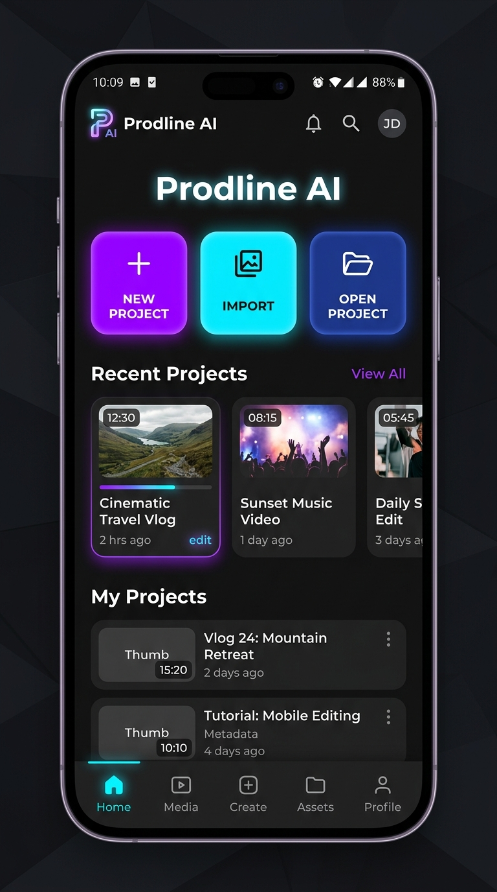
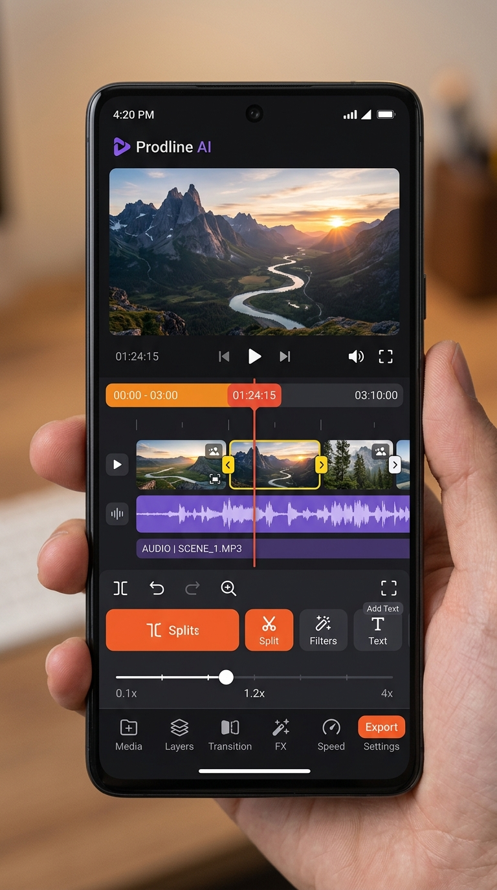
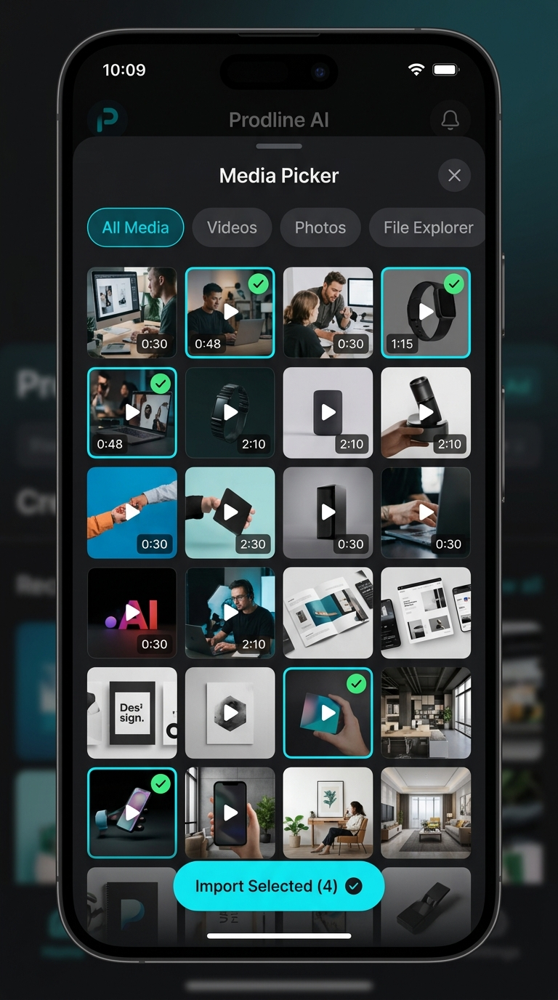
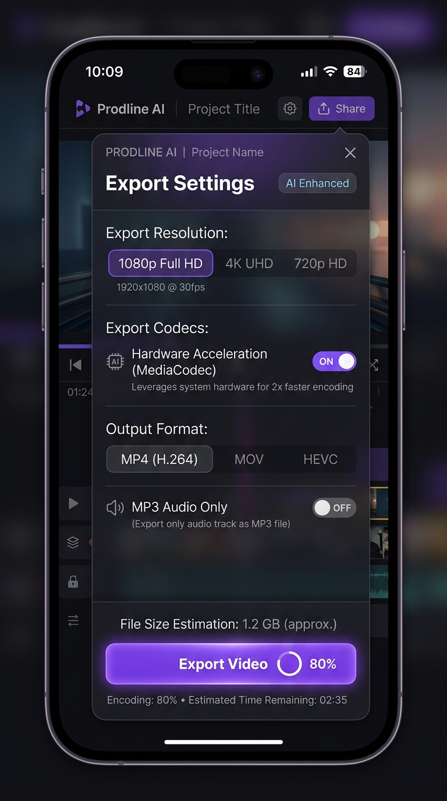

# Prodline AI

<div align="center">
  
  <br/>
  <br/>

  <a href="https://github.com/Vicky8106/Prodline-AI/stargazers">
    
  </a>
  <a href="https://github.com/Vicky8106/Prodline-AI/network/members">
    
  </a>
  <a href="LICENSE">
    
  </a>
  <a href="https://github.com/Vicky8106">
    
  </a>
</div>

<br/>

**Prodline AI** is a modern, high-performance, open-source video and media editing application for Android. Engineered for creator velocity, privacy, and full offline workflow, Prodline AI lets you compose, edit, trim, filter, and render watermark-free videos and photos entirely on your device with hardware-accelerated encoding.

---

## 📌 Project Origin & Attribution

> **Attribution**:  
> Prodline AI is originally based on and forked from the open-source project [LibreCuts](https://github.com/tharunbirla/LibreCuts) created by **Tharun Birla**.  
>  
> The project is actively developed and expanded by **[Vicky8106](https://github.com/Vicky8106)** (`wiki8106work`). All major architectural upgrades, multi-media photo import integrations, custom file explorer navigation, timestamp parsing resilience, and new feature implementations are maintained under this repository. See [CHANGELOG.md](CHANGELOG.md) for full details on the differences and additions compared to the original upstream project.

---

## 🚀 Key Features

### 🎬 Multi-Format Media & Photo Ingestion
- **Full Image & Video Import**: Import photos (`.jpg`, `.jpeg`, `.png`, `.webp`, `.bmp`, `.heic`) and video clips into the main sequence timeline.
- **Custom Frame Durations**: Automatic duration mapping for static image assets with fine-grained length adjustments.
- **Aspect-Ratio Adaptation**: Automatic scaling, letterboxing, and blur-canvas backgrounds for mixed portrait and landscape content.

### 🗂️ Tabbed Media Picker & In-App File Explorer
- **Categorized Picker Tabs**: Instant switching between **All Media**, **Videos**, and **Photos**.
- **Visual Selection Badges**: Green selection highlights, item index counters, and real-time asset previews.
- **Hierarchical File Explorer**: Built-in directory tree navigation with breadcrumb path jumps and file-type filters.

### ⏱️ Resilient Duration & Timestamp Processing
- **Smart Timestamp Engine (`TimestampParser`)**: Robust parsing across microsecond FFmpeg outputs, `HH:MM:SS.mmm` strings, and variable frame rate (VFR) media.
- **Audio-Video Synchronization**: Dynamic reconciliation between audio track lengths and video keyframe boundaries.

### ✂️ Precision Timeline & Sequence Editing
- **Trim & Split**: Slice and rearrange clips with millisecond accuracy using interactive tactile waveform and scrub handles.
- **Multi-Clip Sequence Merging**: Combine multiple video and image segments into a single cohesive project.
- **Freeze Frame & Speed Control**: Freeze specific frames or adjust playback speed from `0.1x` slow-mo to `4.0x` high-speed ramping.
- **Reverse Playback**: Create reverse video effects with dedicated background proxy generation.

### 🎨 Layering, Graphics & Visual Effects
- **Rich Overlays**: Add movable, resizable text, images, stickers, GIFs, and secondary video picture-in-picture (PiP) layers.
- **Keyframe Animation**: Animate position, scale, and opacity over time.
- **Chroma Key & Masking**: Isolate subjects with green screen chroma keying and custom geometric mask shapes.
- **Color Filters & Grading**: Adjust brightness, contrast, saturation, and apply artistic LUT color filters.
- **Handwriting & Freehand Draw**: Sketch and annotate directly over video frames with custom brush sizes and colors.

### 🎵 Pro Audio Suite
- **Multi-Track Audio**: Import external songs, record live voice-overs with microphone input, and blend soundtrack volume levels up to 200%.
- **Waveform Extraction**: Visual audio waveform bars for visual beat alignment.
- **Audio Ducking & Fades**: Apply smooth fade-in and fade-out curves to background audio.
- **MP3 Standalone Export**: Export your project's audio mix directly as an MP3 file.

### ⚡ Local Hardware Acceleration & Export
- **MediaCodec Hardware Acceleration**: Rapid video exports using on-device `h264_mediacodec` encoders with fallback to FFmpeg software encoding.
- **Quality Presets**: Export in High (1080p Original), Medium, or Low quality.
- **100% Privacy & No Watermarks**: All encoding happens locally without external servers.
- **Project Serialization**: Save and restore editable project states as `.lcprj` / `.plprj` files.

---

## 📱 Screenshots

<div align="center">
  <table>
    <tr>
      <td align="center"></td>
      <td align="center"></td>
      <td align="center"></td>
      <td align="center"></td>
    </tr>
    <tr>
      <td align="center"><b>Home & Projects</b></td>
      <td align="center"><b>Editor & Overlays</b></td>
      <td align="center"><b>Tabbed Media Picker</b></td>
      <td align="center"><b>Export & Settings</b></td>
    </tr>
  </table>
</div>

---

## 📦 What's Different from Upstream?

Check out our comprehensive [**CHANGELOG.md**](CHANGELOG.md) to see everything added and improved in **Prodline AI** (`wiki8106work`):

| Feature / Area | Upstream LibreCuts | Prodline AI (`wiki8106work`) |
| :--- | :--- | :--- |
| **Photo / Image Import** | Unsupported / Crash prone | Full support with auto-duration & canvas fit |
| **Media Picker UI** | Basic single-type list | Tabbed (Videos, Photos, All) + selection badges |
| **File Navigation** | Basic file tree | Advanced breadcrumb path explorer + type filters |
| **Timestamp Parsing** | Strict string formats | Robust `TimestampParser` with subsecond fallbacks |
| **Unit Testing** | Minimal unit tests | Dedicated parser and duration unit test suite |
| **Branding & Config** | LibreCuts base | Prodline AI enhanced suite |

---

## 🛠️ Getting Started

### Prerequisites
- Android Studio Hedgehog (2023.1.1) or newer
- Android SDK (API 26 to API 34+)
- JDK 17

### Installation

1. **Clone the repository**:
   ```bash
   git clone https://github.com/Vicky8106/Prodline-AI.git
   cd Prodline-AI
   ```

2. **Open in Android Studio**:
   - Open Android Studio and select **Open**.
   - Navigate to the cloned `Prodline-AI` directory and wait for Gradle synchronization.

3. **Build and Run**:
   - Connect an Android device or launch an emulator.
   - Run:
     ```bash
     ./gradlew assembleDebug
     ```
   - Or click the **Run** (▶) button in Android Studio.

---

## 🔒 Permissions

Prodline AI requests minimal permissions strictly necessary for local media processing:
- `READ_MEDIA_VIDEO` / `READ_MEDIA_IMAGES` / `READ_MEDIA_AUDIO`: To import media files on Android 13+ (API 33+).
- `READ_EXTERNAL_STORAGE` / `WRITE_EXTERNAL_STORAGE`: For file reading and saving on legacy Android versions.
- `RECORD_AUDIO`: Required only when recording voice-over audio in the editor.
- `POST_NOTIFICATIONS`: To display background video rendering progress.

---

## 🤝 Contributing (`wiki8106work`)

Contributions, bug reports, and pull requests are welcome!

1. Fork the [Prodline AI Repository](https://github.com/Vicky8106/Prodline-AI).
2. Create a feature branch: `git checkout -b feature/amazing-feature`.
3. Commit your changes: `git commit -m 'feat: add amazing feature'`.
4. Push to your branch: `git push origin feature/amazing-feature`.
5. Open a Pull Request on GitHub.

---

## 💖 Support & Community

If Prodline AI helps your creative workflow, consider starring the repository:

- 🌟 **Star on GitHub**: [Vicky8106/Prodline-AI](https://github.com/Vicky8106/Prodline-AI)
- 🐛 **Report an Issue**: [Issue Tracker](https://github.com/Vicky8106/Prodline-AI/issues)

---

## 📝 License

This project is licensed under the **MIT License**. See the [LICENSE](LICENSE) file for complete terms and copyright notices.
